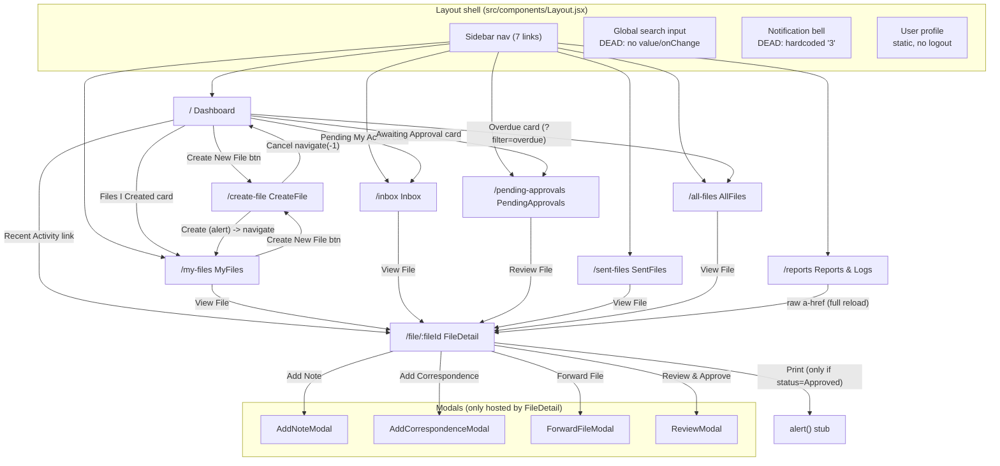
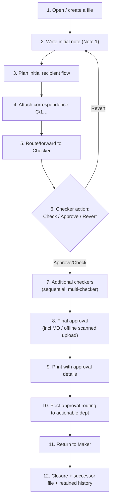
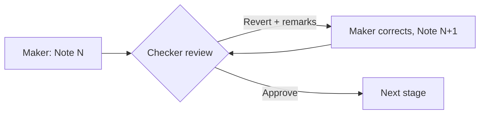
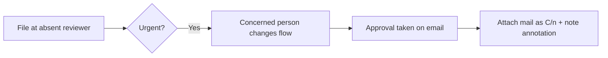
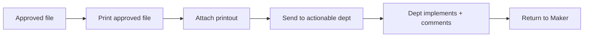

# 03 — Screen & Flow Map

> **How to read this document.** Every claim is tagged by source:
> - **[OBSERVED]** — seen directly in prototype code (cited as `path:line`).
> - **[SPECIFIED]** — stated in the SOW / DOCX background.
> - **[CLARIFIED]** — from the handwritten annotations (cited by H-number).
> - **[INFERRED]** — a reasonable assumption, flagged as such.
>
> **Standing fact for the whole app:** there is no auth, no role model, and no persistence. `currentUser` is a hardcoded singleton (`src/data/dummyData.js:3-9`), and *every* state-mutating action ends in an `alert('… (Demo mode)')` and persists nothing. So when this map says a step is "supported," that almost always means **the UI to trigger it exists and navigates/opens a modal**, while the actual mutation is a demo stub. This is called out per step rather than repeated everywhere.

---

## 1. Top-Level Navigation Map

There are **9 routes** [OBSERVED `src/App.jsx:19-27`] and **4 modals** hosted only by `FileDetail` [OBSERVED `src/pages/FileDetail.jsx:308-344` open the modals; modal files under `src/components/`]. The sidebar exposes **7 of the 9 routes**; `/create-file` and `/file/:fileId` have **no nav entry** and are reached only from in-page buttons/links [OBSERVED `src/components/Layout.jsx:23-31`; `/create-file` reached via Dashboard/MyFiles buttons, `/file/:fileId` via list cards]. There is **no catch-all/404 route** [OBSERVED `src/App.jsx:18-28` — unknown URLs render the shell with a blank main area].

### Navigation notes (caveats baked into the map)
- **Overdue deep-link is dead.** Dashboard's Overdue card links to `/all-files?filter=overdue` [OBSERVED `src/pages/Dashboard.jsx:55`] but `AllFiles` never reads the query string [OBSERVED `src/pages/AllFiles.jsx` has no `useSearchParams`/`useLocation`] — it lands on the unfiltered list.
- **Reports row links bypass the router.** Reports uses a raw `<a href>` instead of `<Link>` [OBSERVED `src/pages/Reports.jsx:159`], causing a full-page reload.
- **Global search, notifications, user profile are decorative** [OBSERVED `src/components/Layout.jsx:56-61, 63-66, 67-73` — no handlers].
- **Modals live only on FileDetail.** No modal is reachable from any list screen; the entire mutating-action surface funnels through `FileDetail`.

---

## 2. Main Happy-Path Journey (end to end)

This is the canonical N-C lifecycle [SPECIFIED SOW §4 Lifecycle, §5 Movement, §9 Closure]. Each step states the prototype's support level.

| # | Step | Source / Support | Evidence & gap |
|---|------|------------------|----------------|
| 1 | **Open / create a file** | **[OBSERVED — partial]** | `CreateFile` form exists and routes; submit is a stub `alert('File created successfully! (Demo mode)')` then `navigate('/my-files')` [OBSERVED `src/pages/CreateFile.jsx:19-24`]. New file never enters `dummyData`. File Number is **free-text**, not auto-generated [OBSERVED `src/pages/CreateFile.jsx:49-58`] — **conflicts** with H1 "Auto-generated Sr. no. upon submission" [CLARIFIED H1]. **No UN-number field** in the form though `unNumber` exists on the entity [OBSERVED no UN field in `CreateFile.jsx`; field at `src/data/dummyData.js:33`]. SOW says "new file can be opened by anyone" [SPECIFIED SOW §3.1]. |
| 2 | **Write initial note (Note 1)** | **[OBSERVED — stub]** | `AddNoteModal` composes a note; submit `alert('Note submitted successfully! (Demo mode)')` [OBSERVED `src/components/AddNoteModal.jsx:15-23`]. Author = hardcoded `currentUser` [OBSERVED `:176`]. Note 1 author renders at **right** margin, later notes at **left** [OBSERVED `src/pages/FileDetail.jsx:368, 379`] — matches the physical convention [SPECIFIED SOW §2.2A; CLARIFIED H7 L=Noting]. |
| 3 | **Plan initial recipient flow** | **[SPECIFIED / ABSENT in create]** | SOW: originator plans the initial flow at note time [SPECIFIED SOW §3.1, §5]; H13/S18 want add-checker/recipient [CLARIFIED H13]. **No recipient/routing UI exists at creation** [OBSERVED `src/pages/CreateFile.jsx` has none]. The *only* recipient picker is `ForwardFileModal`, available later from `FileDetail` [OBSERVED `src/components/ForwardFileModal.jsx`]. So initial-flow planning is **deferred to forward time and not at creation** — a structural gap vs SOW. |
| 4 | **Attach correspondence (C/1, C/2 …)** | **[OBSERVED — stub]** | `AddCorrespondenceModal`: real file selection + drag-drop into local state [OBSERVED `src/components/AddCorrespondenceModal.jsx:42-46, 151-157`], next number shown as `C/${length+1}` [OBSERVED `:15, 60-64`]; submit is `alert(...added successfully! (Demo mode))` [OBSERVED `:35-40`]. `fileUrl` is always `'#'` [OBSERVED `src/data/dummyData.js:136`]; correspondence View/Download buttons on FileDetail have **no handler** [OBSERVED `src/pages/FileDetail.jsx:429-434`]. First doc as C/1 [SPECIFIED SOW §4.1]. |
| 5 | **Route / forward to Checker** | **[OBSERVED — stub]** | `ForwardFileModal`: section filter, multi-select, reorder, priority, remarks, empty-recipient guard all real client-side [OBSERVED `src/components/ForwardFileModal.jsx:28-48, 13-15`]; submit `alert('File forwarded to N recipient(s)! (Demo mode)')` [OBSERVED `:17-26`]. Does **not** change `currentAssignee` or add a `movement`. |
| 6 | **Checker action: Check / Approve / Revert** | **[OBSERVED — stub, scope creep]** | `ReviewModal` exposes **6** actions (Check, Approve, Revert, Approve-with-Conditions, Reject, Request Clarification) [OBSERVED `src/components/ReviewModal.jsx:72-113`] vs the canonical **3** [SPECIFIED S6c; CLARIFIED handwriting names Check/Approve/Revert]. Submit `alert('File {action}! (Demo mode)')` [OBSERVED `:17-26`]. **H5** wants each action to record date-time + dept [CLARIFIED H5] — **not captured** (remarks/signature/dept all discarded on submit). |
| 7 | **Additional checkers (sequential, multi-checker)** | **[SPECIFIED / data-modeled, no runtime]** | `File.checkers[]` and `Note.checkerComments[]` model multiple checkers [OBSERVED `src/data/dummyData.js:47-49, 115-123`], satisfying S6a/S6b as **seed data only**. No code produces a second checker pass; everything is the same stubbed `ReviewModal`. |
| 8 | **Final approval incl. MD / offline scanned upload** | **[OBSERVED — CRASH on MD path]** | Approve action is stub. The **"Upload Offline MD Approval"** area renders `<FiUpload/>` [OBSERVED `src/components/ReviewModal.jsx:174`] but `FiUpload` is **not imported** [OBSERVED imports `:2` = FiX,FiCheck,FiXCircle,FiArrowLeft,FiSend] → **ReferenceError crash** when revealed. S11 (MD offline scan) is therefore **broken, not merely stubbed**. |
| 9 | **Print with approval details** | **[OBSERVED — stub]** | Print button shows **only when** `status==='Approved'` [OBSERVED `src/pages/FileDetail.jsx:333`]; onClick `alert('Print functionality: … sign, date, time, approver, location … maker, checker, final approver (Demo mode)')` [OBSERVED `src/pages/FileDetail.jsx:338`]. No template, **no page-range, no summary page** [SPECIFIED S16; CLARIFIED H11 "Rasika Mam", H18 page-no-wise — ABSENT in code]. S14 approval-on-print details exist only as alert text. |
| 10 | **Post-approval routing to actionable dept** | **[SPECIFIED / ABSENT]** | S19 + H14 "Print, attached & send" to actionable dept [SPECIFIED S19; CLARIFIED H14]. No dedicated post-approval routing exists; the only routing tool is the generic `ForwardFileModal` (a stub) [OBSERVED `src/components/ForwardFileModal.jsx`]. No "return to Maker" step is modeled. |
| 11 | **Return to Maker** | **[SPECIFIED / ABSENT]** | SOW: file "generally reverts to the originator" after processing [SPECIFIED SOW §2.2A, §5]. `Movement.action` only ever `'Forwarded'` in data [OBSERVED `src/data/dummyData.js:158`]; no Return action/UI. |
| 12 | **Closure + successor file + retained history** | **[SPECIFIED / ABSENT]** | Closure with closing date, reason, successor file number, retained start/end period + movement history [SPECIFIED SOW §9; CLARIFIED H17 "File close date"]. Status `'Closed'` never appears in data, `endPeriod` always null [OBSERVED `src/data/dummyData.js:45`], no closure UI [OBSERVED none]. |

**Bottom line:** the prototype supports steps 1–9 as **navigable UI with demo-mode mutations** (step 8's MD-upload path actually crashes), and steps 10–12 are **absent** beyond the generic forward stub.

---

## 3. Edge Flows

Each subsection states prototype support. Recurring caveat: mutations are demo-mode.

### 3.1 Revert loop (return for correction)
[SPECIFIED SOW §4.3, §10] Reviewer returns the file; originator corrects and resubmits.

**Support:** **[OBSERVED — stub].** `ReviewModal` has a `Revert` action [OBSERVED `src/components/ReviewModal.jsx:72-113`] and a required remarks field [OBSERVED `:140`], but submit only `alert()`s [OBSERVED `:17-26`]; nothing reverts assignment or creates a new note. The corrected resubmit re-uses the same stubbed `AddNoteModal`.

### 3.2 Multiple checkers, sequential commenting incl. comment AFTER approval (S6b)
[SPECIFIED S6a, S6b — commenting after checker approval]

**Support:** **[SPECIFIED / data-modeled only].** `File.checkers[]` (status `checked`/`approved`) and `Note.checkerComments[]` exist as seed data [OBSERVED `src/data/dummyData.js:47-49, 115-123`]. `ReviewModal` is a single generic review screen with **no notion of checker order or "comment after approval"** [OBSERVED `src/components/ReviewModal.jsx` — no checker sequencing logic]. So S6b is representable in the model but **not demonstrable** at runtime.

### 3.3 Add recipient / checker mid-flow (H13 / S18)
[SPECIFIED S18 pre-defined recipient workflow with modification; CLARIFIED H13 "Add checker / recipient"]

**Support:** **[OBSERVED — partial UI, stub].** `ForwardFileModal` lets you add/reorder recipients [OBSERVED `src/components/ForwardFileModal.jsx:28-48`] and its helper text claims "Order can be changed by any recipient later" [OBSERVED `:88`] — but **no such later-reorder mechanism exists**, and the forward itself is a stub [OBSERVED `:17-26`]. There is also an unfinished "Forward To" free-text field in `ReviewModal` (no picker), shown only when `action==='approve'` [OBSERVED `src/components/ReviewModal.jsx:200-206`].

### 3.4 Reviewer on leave → reroute + "approval received on mail" (SOW §5)
[SPECIFIED SOW §5: colleague takes approval on mail, attaches mail to correspondence, writes "on leave, approval received on mail"]

**Support:** **[SPECIFIED / ABSENT as a flow].** No "on leave"/delegate concept anywhere [OBSERVED none]. The closest building blocks are the email-reference option in `AddCorrespondenceModal` [OBSERVED `src/components/AddCorrespondenceModal.jsx:196-206`] and free-text notes — but no delegation, reroute-on-absence, or "approval received on mail" handling.

### 3.5 MD approval / offline scanned approval (S11)
[SPECIFIED S11 MD approval incl. upload of scanned offline approvals; CLARIFIED H9 groups with print/signature bundle]

**Support:** **[OBSERVED — CRASH].** Toggle "Upload Offline MD Approval" flips `showMdUpload` [OBSERVED `src/components/ReviewModal.jsx:153-159`], revealing an area that renders `<FiUpload/>` which is **not imported** → ReferenceError [OBSERVED `:174` vs imports `:2`]. This is the one happy-path-adjacent feature that **breaks** rather than stubs.

### 3.6 Post-approval routing-and-return ("Print, attached & send" — H14 / S19)
[SPECIFIED S19 route to actionable dept then return to Maker; CLARIFIED H14 print → attach → send]

**Support:** **[SPECIFIED / ABSENT].** No combined print-attach-send action and no "return to Maker" step [OBSERVED none]. Print is a stub alert [OBSERVED `src/pages/FileDetail.jsx:338`]; routing is the generic stubbed forward.

### 3.7 Cross-department permanent transfer (SOW additional points)
[SPECIFIED SOW "ADDITIONAL POINTS": permanent transfer across departments, e.g. Recovery → Legal]

**Support:** **[SPECIFIED / ABSENT].** No transfer-of-ownership-across-department UI [OBSERVED none]. `ForwardFileModal` can pick another section's users but is (a) a stub and (b) a *forward*, not a *permanent transfer*; nothing reassigns the file's owning section/`createdBy`.

### 3.8 File closure + successor file + retained history (SOW §9 / H17)
[SPECIFIED SOW §9; CLARIFIED H17 "File close date"; H16 header/footer must show file name / period / UN-No.]

**Support:** **[SPECIFIED / ABSENT].** No closure UI, `'Closed'` status unused, `endPeriod` null, no successor-file linkage [OBSERVED `src/data/dummyData.js:45`; status enum never `Closed`]. Movement history *renders* [OBSERVED `src/pages/FileDetail.jsx` movement timeline] but is static seed data only.

### 3.9 Confidential files (SOW §7; Phase 2 parts)
[SPECIFIED SOW §7 restricted access, movement only with signature; temp-file/merge is Phase 2]

**Support:** **[OBSERVED — cosmetic only].** `confidential:true` on file3 [OBSERVED `src/data/dummyData.js:250`] renders a CONFIDENTIAL badge [OBSERVED `src/pages/AllFiles.jsx:108-110`, `src/pages/FileDetail.jsx:249`] but **no access gating** — any user opens it, and its activity even leaks into Reports logs [OBSERVED `src/pages/Reports.jsx` aggregates all files]. Temp-file/merge for simultaneous use is explicitly Phase 2 [SPECIFIED SOW §7] and absent.

### 3.10 Suo-moto note (no correspondence, SOW §8)
[SPECIFIED SOW §8: internal notes without correspondence]

**Support:** **[INFERRED supported by accident].** No distinct "suo-moto" flow exists [OBSERVED none], but because `AddNoteModal` and `AddCorrespondenceModal` are independent [OBSERVED `src/pages/FileDetail.jsx:308-326`], a user can add a note without ever adding correspondence — which structurally *is* a suo-moto note, just not labeled or treated as a distinct concept. [INFERRED — the prototype neither names nor enforces it.]

---

## 4. Summary: Support Level at a Glance

| Flow | Prototype support |
|------|-------------------|
| Top-level navigation (9 routes) | [OBSERVED] real routing; 2 dead deep-links (overdue, raw a-href) |
| 1 Create file | [OBSERVED] stub; free-text file no., no UN field (conflicts H1) |
| 2 Initial note | [OBSERVED] stub |
| 3 Plan initial flow at creation | [SPECIFIED] ABSENT at create (only at forward) |
| 4 Attach correspondence | [OBSERVED] stub; View/Download dead |
| 5 Forward to checker | [OBSERVED] rich UI, stub submit |
| 6 Check/Approve/Revert | [OBSERVED] stub; 6 actions vs 3 spec; no date/dept (H5) |
| 7 Multiple checkers | [SPECIFIED] data-modeled, no runtime |
| 8 Final/MD/offline approval | [OBSERVED] **CRASH** (FiUpload) |
| 9 Print w/ approval details | [OBSERVED] stub; no page-range/summary (H11/H18) |
| 10 Post-approval routing | [SPECIFIED]/[CLARIFIED H14] ABSENT |
| 11 Return to Maker | [SPECIFIED] ABSENT |
| 12 Closure + successor | [SPECIFIED]/[CLARIFIED H17] ABSENT |
| Revert loop | [OBSERVED] stub |
| Comment after approval (S6b) | [SPECIFIED] data-modeled only |
| Add recipient/checker mid-flow (H13) | [OBSERVED] partial UI, stub |
| Reviewer-on-leave reroute | [SPECIFIED] ABSENT |
| Cross-dept permanent transfer | [SPECIFIED] ABSENT |
| Confidential files | [OBSERVED] cosmetic, no gating |
| Suo-moto note | [INFERRED] accidental, unlabeled |

> **Note for backend planning (open question, not a decision):** the central asymmetry is that the *data model* already represents the multi-checker / approval / movement / reference graph well [OBSERVED `src/data/dummyData.js`], while the *flow engine* (state transitions, assignment changes, role gating, closure, return-to-maker) does not exist at all. The MD-upload crash (`ReviewModal` missing `FiUpload`) and the AddNote "Search Approved Files" crash (`AddNoteModal` referencing undefined `files`, [OBSERVED `src/components/AddNoteModal.jsx:31-45`]) should be logged in `07_open_questions` as must-fix before any demo of those paths.