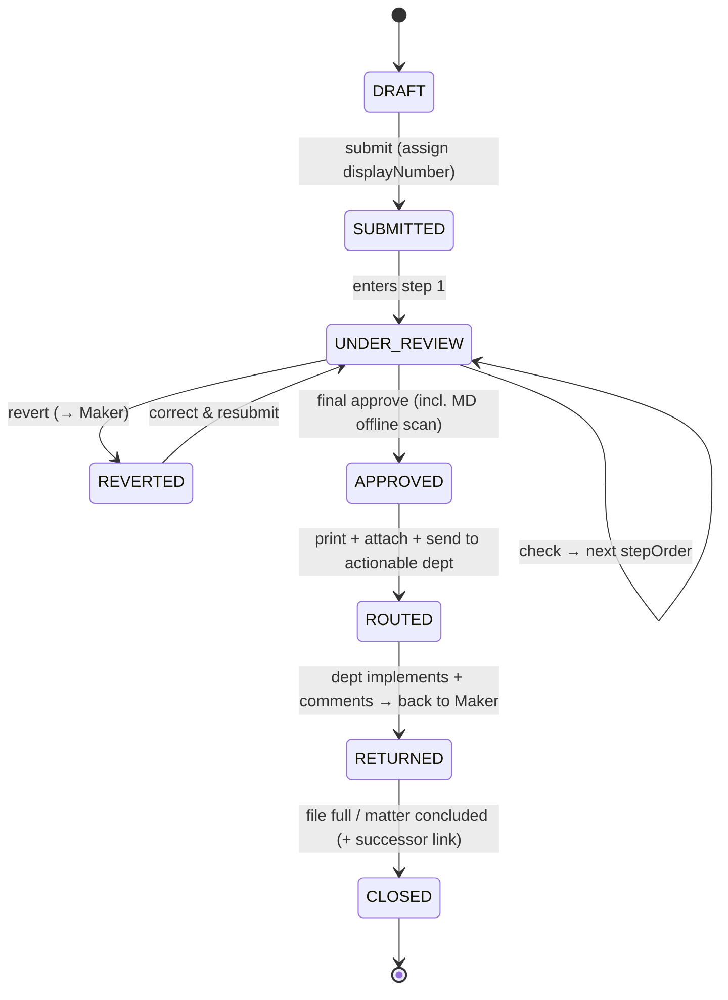
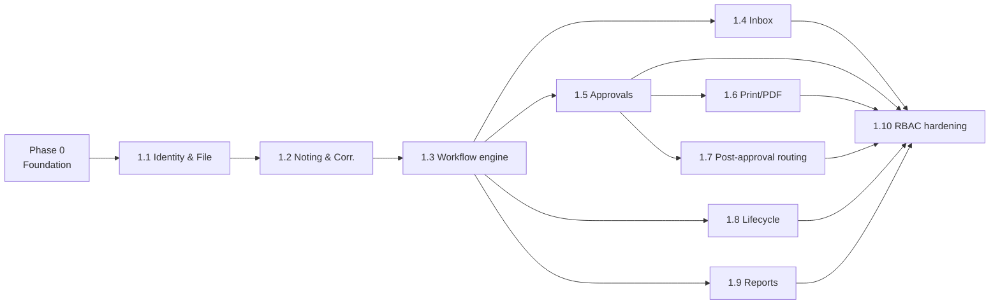

# 09 — Implementation Plan (Architecture, Phases & Sequences)

**Date:** 2026-07-03 · **Baseline:** decisions in [`08_requirements_decisions.md`](08_requirements_decisions.md), data model in [`04_inferred_data_model.md`](04_inferred_data_model.md), gaps in [`06_sow_traceability_and_gaps.md`](06_sow_traceability_and_gaps.md).

This is the build plan for the e-Office N-C system. The current repo is a frontend-only demo (mock data, `Demo mode` stubs); per the client, **everything is built from scratch (greenfield backend)** — the React screens are a UX reference to preserve, not working software.

> **One gate before coding:** the tech-stack / DB / auth choices in §2 are marked **"recommended — pending your confirmation."** They are hard to reverse, so I'll confirm them with you (see the questions posted alongside this plan) before scaffolding. Everything else — the phases, sequences, data model, and task breakdown — is settled and below.

---

## 1. Goals & guiding principles

1. **Faithful digital N-C file** — two sides (Noting/Correspondence), permanent audit trail, signed & dated actions, full movement history.
2. **Workflow-first** — a real state machine (not stubs): draft → submit → sequential review (check/approve/revert loop) → final approval → post-approval routing → return → closure.
3. **Immutable audit** — submitted notes and every movement are append-only; nothing is silently deleted (SD §2.2A/§5/§9).
4. **RBAC + section scoping** — Maker/Checker/Approver/MD, with edit-rights gated to author + `DRAFT`/`REVERTED` status (decision D3).
5. **Preserve the approved UX** — keep the React screens/flows; swap `dummyData.js` for a real API.
6. **Phase discipline** — ship a working vertical slice early; defer Phase-2 items (multi-format attach, DMS, PKI, page-level linking, email sync, notifications). Mobile and org-wide tracking are **out of scope**.

---

## 2. Recommended architecture *(pending your confirmation)*

| Layer | Recommendation | Why | Alternatives |
|-------|----------------|-----|--------------|
| **Repo shape** | **Monorepo**: keep `/` React app (Vite) as `client/`; add `server/` (API) + `prisma/` (schema). Shared `packages/shared` for TS types/enums. | One checkout, shared types, incremental migration off `dummyData.js`. | Two repos (more overhead) |
| **Backend** | **Node.js + Express + TypeScript** | Same language as the frontend (team velocity), huge ecosystem, quick to a working slice. | **NestJS** (more structure/guards/DI — the "scale" option); Python FastAPI; ASP.NET (if you're a .NET shop) |
| **ORM + DB** | **Prisma** + **PostgreSQL** (prod), **SQLite** for instant local dev (Prisma swaps via connection string) | Relational fits the workflow/audit/step tables; migrations + type-safety. | Drizzle; TypeORM; raw SQL; MySQL |
| **Auth** | **JWT (access + refresh) + bcrypt**, RBAC middleware, section-scoped | Self-contained, works offline, no external dependency to start. Abstracted so **AD/LDAP/SSO** can slot in later. | Session cookies; **AD/LDAP/SSO from day one** (common for gov/PSU — tell me if required) |
| **File storage** | **Local disk** via a `StorageProvider` interface (Phase 1, **PDF only** — decision C13) | Simple; the interface lets us swap to S3/Azure Blob for the Phase-2 DMS without touching call sites. | S3/Azure Blob now |
| **PDF generation** | **Server-side HTML→PDF (Puppeteer/Playwright)** | Needed for the rich print: two PDFs (Noting + Correspondence), side-by-side layout, approval-summary table, confidential watermark, header/footer (D5/D6). Reuses HTML/CSS skills. | `pdfkit`/`pdf-lib` (more manual layout) |
| **API style** | **REST** (`/api/v1/...`), JSON, OpenAPI later | Straightforward for CRUD + actions; matches the screen set. | GraphQL (overkill here) |
| **Validation** | **Zod** shared client/server | One schema, typed, good errors. | class-validator (if NestJS) |
| **Testing** | **Vitest** (unit) + **Supertest** (API) + a few Playwright E2E on the critical workflow | Fast, JS-native, matches Vite. | Jest |

**Everything is designed behind interfaces at the two volatile seams** — `StorageProvider` (disk→cloud for DMS) and `AuthProvider` (local JWT→AD/SSO) — so the Phase-2 / integration changes don't ripple.

---

## 3. Repository structure (target)

```
eoffice/
├─ client/                 # existing Vite React app (moved from repo root)
│  └─ src/ ... (screens kept; dummyData.js → api client)
├─ server/
│  ├─ src/
│  │  ├─ modules/          # files, notes, correspondence, workflow, auth, print, reports
│  │  ├─ middleware/       # auth, rbac, error, audit
│  │  ├─ services/         # numbering, storage, pdf, statemachine
│  │  └─ app.ts, server.ts
│  └─ tests/
├─ prisma/
│  ├─ schema.prisma
│  ├─ migrations/
│  └─ seed.ts              # ports the dummyData users/files as realistic seed
├─ packages/shared/        # enums, zod schemas, TS types shared client↔server
└─ docs/                   # (this discovery+plan set)
```

---

## 4. Data model (planned — derived from `04` + `08` decisions)

Full Prisma DDL is written in Phase 0. Shape and the decisions baked in:

**Core entities**
- **User** — `id (uuid)`, `name`, `designation`, `section`, `role (MAKER|CHECKER|APPROVER|MD|ADMIN)`, `email`, `passwordHash`, `active`.
- **File** — `id (uuid, PK, permanent)`; **`displayNumber`** = `DEPT/YEAR/SEQ` (e.g. `ACC/2026/001`, generated on submit — D1); **`customFileNumber?`** (optional user label — D1); `subject/purpose`; `section`; `status (enum, see §5)`; `confidential (bool)`; `startPeriod?`, `endPeriod?` (both optional — SD §2.1); `createdById`, `createdAt`, `lastUsedAt`; `currentHolderId` (the lock/holder — H6); `closeDate?`, `closeReason?`, `successorFileId?` (closure — SD §9); `inboxState` **derived** (Inward/Outward — D7).
- **Note** — `id`, `fileId`, `noteNumber (per-file seq)`, `content`, `authorId`, `authorRole`, `status (DRAFT|SUBMITTED|CHECKED|APPROVED)`, `isSuoMoto (bool)`, `createdAt`, `submittedAt?`. Editable only by author while `DRAFT`/`REVERTED` (D3).
  - **NoteReference** — `noteId`, `targetType (CORRESPONDENCE|NOTE)`, `targetRef (C/n or Note n)`.
  - **ParagraphApproval** — `noteId`, `paragraphMark ('A'…)`, `approvedById`, `approvedAt` (SD §4.2).
  - **CheckerComment** — `noteId`, `authorId`, `comment`, `action`, `createdAt` (post-approval comments append-only — C7).
- **Correspondence** — `id`, `fileId`, `number (C/n)`, `type`, `title`, `inwardDate?`, `inwardNumber?` (both optional — SD §6), `uploadedById`, `storageKey`, `mime (application/pdf)`, `createdAt`.
- **WorkflowStep** — `id`, `fileId`, **`stepOrder`** (sequential — C6), `assigneeId`, `roleAtStep`, `status (PENDING|CHECKED|APPROVED|REVERTED)`, `actedAt?`, `remarks?`, `dept?`, `signatureName?`. This **is** the modifiable recipient list (Add/remove-if-not-completed/reorder — C5).
- **Movement / AuditEvent** *(append-only)* — `id`, `fileId`, `type (CREATE|FORWARD|CHECK|APPROVE|REVERT|RETURN|ROUTE|TRANSFER|CLOSE|UPLOAD|SIGN)`, `actorId`, `fromUserId?`, `toUserId?`, `fromSection?`, `toSection?`, `dept?`, `remarks?`, `createdAt`. Every state change writes one (H5, SD §5).
- **Attestation** (embedded on approvals/steps) — `name`, `designation`, `section (=“Location” — C11)`, `timestamp`, `typedSignature` (Phase 1 — A2; PKI deferred).

**Numbering service** — on submit: `seq = max(seq for dept+year)+1`; `displayNumber = ${deptCode}/${year}/${seq}` (per-dept, resets yearly — D2); UUID is the permanent PK; sequence transactional to avoid collisions.

---

## 5. Workflow state machine

**File status:** `DRAFT → SUBMITTED → UNDER_REVIEW → (REVERTED ⇄ resubmit) → APPROVED → ROUTED → RETURNED → CLOSED`. `confidential` is an orthogonal flag; `TRANSFERRED` is a movement, not a terminal state (file keeps its number — D11).



Rules: one **holder** at a time (`currentHolderId`); only the holder can act/edit (D3); checkers act strictly by `stepOrder` (C6); every transition writes a Movement with actor + dept + timestamp (H5) and is immutable.

---

## 6. Phased roadmap

### Phase 0 — Foundation (scaffolding) — *unblocks everything*
Monorepo split (`client/` + `server/`); backend skeleton (Express+TS, error/logging/config); Prisma schema (§4) + first migration; SQLite dev DB; **auth** (register/login, JWT, bcrypt, RBAC middleware); seed script (port `dummyData` users/files → realistic seed); a typed API client in the frontend + `.env`; health-check + one real endpoint (`GET /api/v1/files`) rendering in the existing list screen. **Exit:** the app boots against a real DB and lists seeded files (no more `dummyData.js`).

### Phase 1 — Core N-C workflow (sequenced slices)
Each slice is a **vertical** (DB → API → wire the existing screen) and ends demoable.

| Slice | Delivers | Key screens/endpoints | Depends on |
|-------|----------|-----------------------|------------|
| **1.1 Identity & File CRUD** | Create/open file; auto `DEPT/YEAR/SEQ` + UUID + optional custom; file cover; My Files (last-used sort), All Files (UN+dept filters), created-by visibility | CreateFile, MyFiles, AllFiles, FileDetail cover; `POST/GET /files` | Phase 0 |
| **1.2 Noting & Correspondence** | Notes CRUD + drafts; C/n PDF upload (PDF-only); clickable C/n & Note n refs; two-page view (stacked on screen) | AddNote/AddCorrespondence modals, FileDetail two panes; `/notes`, `/correspondence`, storage | 1.1 |
| **1.3 Workflow engine** | Recipient list + Add Reviewer (add/remove/reorder); sequential `stepOrder`; Check/Approve/Revert (+Reject/Clarify/Conditional variants) with date/time/dept stamp; holder-lock; revert loop | ReviewModal, ForwardFileModal; `/workflow/steps`, `/actions` | 1.2 |
| **1.4 Inbox & queues** | Inward (routed-to-you) / Outward (REVERTED) per D7; Pending Approvals (per-approver); Sent Files | Inbox, PendingApprovals, SentFiles | 1.3 |
| **1.5 Approvals extras** | Multiple sequential checkers; comment-after-approval (append-only); paragraph-level approval; MD offline scan upload; typed-name signature + attestation | ReviewModal extras; `/approvals` | 1.3 |
| **1.6 Print / PDF** | Server PDF: page-range (full/last/custom); approval-summary table (role/name/designation/dept/date-time/location/sign); header/footer + confidential watermark; **two PDFs** Noting + Correspondence (side-by-side) | Print action; `/files/:id/print` | 1.5 |
| **1.7 Post-approval routing** | On approval: print+attach+route to actionable dept → dept implements+comments → return to Maker | routing UI; `/route`, `/return` | 1.5 |
| **1.8 Lifecycle** | Closure (date/reason/successor link, read-only); cross-dept permanent transfer (number unchanged, logged); suo-moto notes; confidential access control (restricted view + signed movement) | closure/transfer UI; `/close`, `/transfer` | 1.3 |
| **1.9 Reports & audit** | Complete file logs; search/section filters (fix the dead ones); **CSV + PDF export** | Reports; `/reports`, `/export` | 1.3 |
| **1.10 RBAC hardening** | Enforce section-level edit rights + role matrix (`05_role_permission_matrix.md`) across all endpoints; confidential gating end-to-end; fix the two prototype crash bugs | cross-cutting middleware | all above |

### Phase 2 — Deferred (not now)
Multi-format attachments + preview (beyond PDF); inbuilt DMS + old-file retrieval/versioning; confidential temp-file split/merge; PKI/DSC certificate signatures; page-level linking inside documents (“C36 on page 5”); live email-mailbox integration (manual email-as-correspondence stays Phase 1); notifications. **Out of scope entirely:** mobile app; org-wide cross-org file tracking.

---

## 7. Sequence / critical path



Critical path: **P0 → 1.1 → 1.2 → 1.3**, then 1.4–1.9 parallelize, converging on **1.10**. 1.3 (workflow engine) is the linchpin — most other slices hang off it.

---

## 8. Cross-cutting concerns (built in from Phase 0)
- **Audit/immutability:** an `audit` middleware + append-only Movement writes on every state change; DB constraints prevent updates to submitted notes.
- **RBAC:** central `authorize(action, resource)` guard reading role + section + holder + note-author + status (encodes `05` matrix + D3).
- **Validation & errors:** shared Zod schemas; uniform error envelope; transactional numbering.
- **Config/secrets:** `.env`; no secrets committed.
- **Testing:** unit (services/state machine), API (Supertest per endpoint), a few Playwright E2E on the create→note→review→approve→print happy path + the revert loop.
- **Seed & demo:** realistic seed so every screen has data from day one.

---

## 9. Risks & mitigations
| Risk | Mitigation |
|------|-----------|
| Numbering collisions under concurrency | Transactional `seq` allocation per dept+year (SELECT … FOR UPDATE / Prisma interactive txn) |
| PDF layout fidelity (two-column, watermark, summary) | HTML→PDF (Puppeteer) so we reuse CSS; lock a template early in 1.6; Rasika to provide a sample PDF (D6) |
| Auth may need AD/SSO later | `AuthProvider` interface from day one |
| Storage moves to cloud DMS (Phase 2) | `StorageProvider` interface from day one |
| Scope creep from the 6 extra review actions | Model the canonical 3 as transitions; extras are variants (C8) |
| Frontend rework migrating off `dummyData.js` | Do it screen-by-screen behind a typed API client; keep screens intact |

---

## 10. "Start" — Phase 0 checklist (begins on your stack confirmation)
1. Restructure repo into `client/` + `server/` + `prisma/` + `packages/shared` (non-destructive; git-tracked).
2. Backend skeleton: Express+TS, config, logging, error handling, `/health`.
3. Prisma schema (§4) + initial migration; SQLite dev DB.
4. Auth: register/login, JWT, bcrypt, RBAC middleware; seed users with roles.
5. Seed files/notes/correspondence from `dummyData`.
6. Typed API client in `client/`; replace `dummyData` in the **All Files / My Files** list first (`GET /api/v1/files`).
7. Green run: `npm run dev` (client) + `npm run dev:server` boot against the DB and list seeded files.

Then proceed slice-by-slice through §6, each ending in a demoable vertical.
